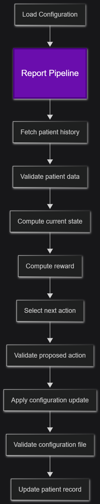
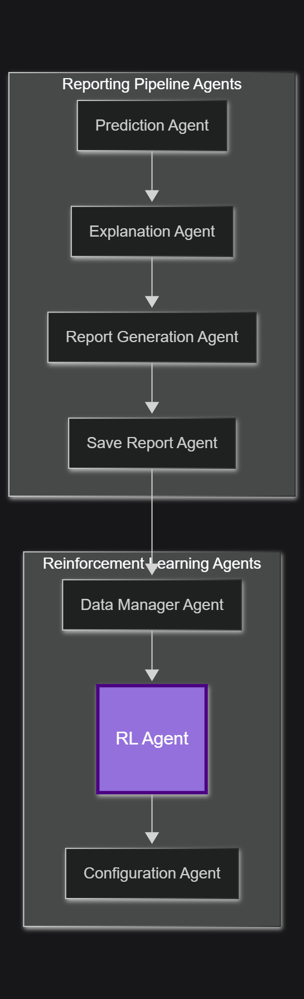
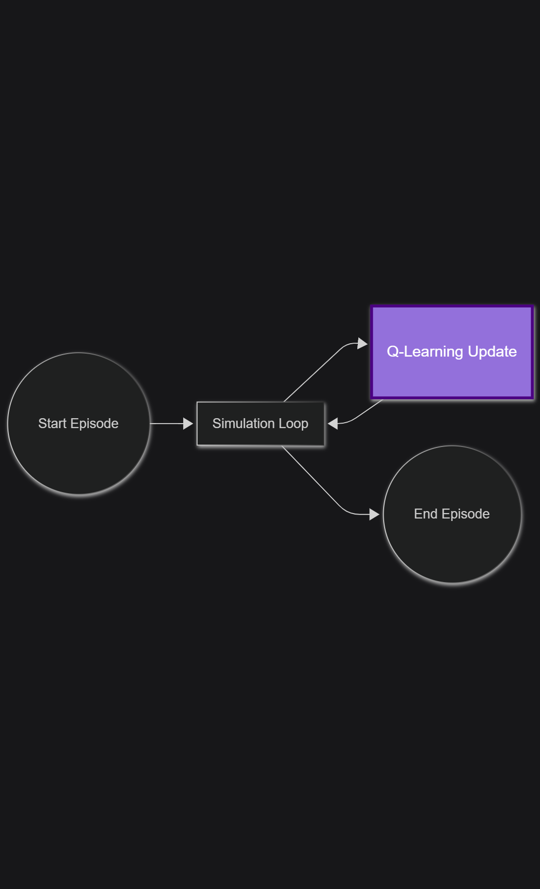
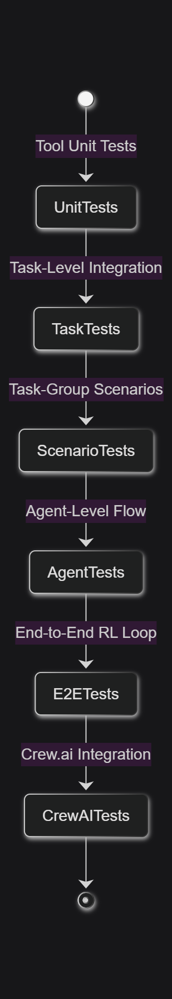
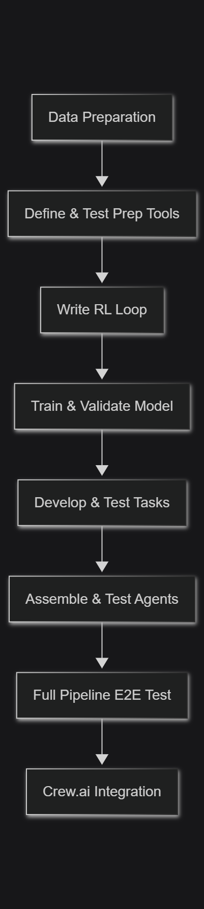

# RL Agent System

## Flow

### Tasks

The reinforcement agent component will need to complete various tasks on each patient, these include:

- **Load configuration (COMPLETED)** (`load_configuration`)
    Load the current configuration for the system's recommendations and shap values.

- **Fetch patient history (COMPLETED)** (`fetch_patient_data`)  
    Retrieve the patient’s most recent CSV record so we can compare their previous state and action.

- **Validate fetched data** (`validate_patient_data`)  
    Ensure the CSV row has all required fields (`probability`, `state`, `action`) and correct types.

- **Compute current state** (`compute_current_state`)  
    Discretize the new model probability into an integer state (0–9) for the MDP.

- **Compute reward** (`apply_reward`)  
    Calculate the reward (+1/0/–1) by comparing the previous state to the current state.

- **Select next action** (`compute_action`)  
    Use a greedy policy over the Q-table to pick the configuration adjustment.

- **Validate proposed action** (`validate_action`)  
    Check that the chosen action exists and won’t push any threshold or `top_k` out of bounds.

- **Apply configuration update (COMPLETED)** (`update_configuration`)  
    Mutate the YAML config file according to the chosen action and clamp to valid bounds.

- **Validate configuration file** (`validate_configuration_file`)  
    Confirm the YAML still contains the expected sections/keys after mutation.

- **Update patient record (COMPLETED)** (`update_patient_data`)  
    Back-fill the last row with reward and next state, then append a fresh row with blank eval fields.

### Tools

The necessary tools needed to complete the above tasks are proposed below. Each set of correlated tasks involve some sort of validating of agent processed data. This pattern could easily be extended later into a *Guardrails Agent(s)*, where after each tasks agents post their output to some sort of _"Validator"_ that gracefully handles any errors redirecting the system's flow.

- **verify_patient_history**
    Check whether a history file already exists for this patient, if not create it and enter the first row

- **read_patient_history (COMPLETED)**
    Read the last CSV row for a given patient `id` file; error if file missing or malformed.

- **validate_patient_data**  
    Verify the fetched row includes `probability`, `state`, and `action` fields with correct types.

- **discretize_probability (COMPLETE)**  
    Map a float from [0,1] into an integer state 0–9.

- **calculate_reward (COMPLETED)**  
    Return +1/0/–1 by comparing `prev_state` to `current_state`.

- **select_policy_action (COMPLETED)**  
    Load Q-table, perform greedy action selection on `current_state`.

- **validate_action**  
    Ensure `new_action` is in the allowed set and won’t drive any config value out of valid range.

- **apply_action_to_config (COMPLETED)**  
    Load & mutate the YAML (thresholds/top_k), clamp values, and save.

- **validate_config_file (COMPLETED)**  
    Reload YAML and check it still contains `thresholds`, `explanation.top_k`, etc.

- **update_patient_history (COMPLETED)**  
    Open CSV, back-fill the previous row’s blank columns, then append a new row with blank _next_ columns, populated _current_ columns.



### Agents

Three agents are hypothesized, where each agent's tasks are correlated.

- **Data Input Agent**

- **Data Export Agent**

- **Policy Agent**

- **Reward Shaping Agent**

### Integration

The reinforcement centric tasks incorporation can be seen below. In summary, an obvious place for RL is after the original prediction->report pipeline, decoupling the RL from the rest of the system. Thus, leading to a much more modular and reusable component, later the RL system could be refactored into a generic RL pipeline to be used in other applications, where "application specific RL" can be injected, but the process remains constant (e.g load data, compute reward ... update data etc).Only loading the systems current configuration would need to be completed prior to or during the report generation/prediction pipeline.



## Reinforcement Learning

### Configuration File

The reinforcement system will work by updating a YAML config file. To begin the file will only contain 3 modifiable parameters; `threshold.moderate`, `thresholds.high`, and `explanation.top_k`. The thresholds give indicators of when the systems give a _"high risk"_, _"moderate risk"_, or _"low risk"_  indication in the report, prompting the clinician's attention. 

- An example of the dynamic file the RL agent will update:
```yml
thresholds:
    # Low being less than 0.3
    moderate: 0.3
    high: 0.7
explanation:
    # How many shap values to 
    # display in the report/give 
    # an explanation of
    top_k: 3
```
## Actions

- The possible actions the **RL Agent** can take involve modifying the above config file. These include:
    - **Risk Thresholds:**
        1. `INCREASE_MODERATE_THRESHOLD`
        2. `DECREASE_MODERATE_THRESHOLD`
        3. `INCREASE_HIGH_THRESHOLD`
        4. `DECREASE_HIGH_THRESHOLD`
    - **SHAP/XAI**
        - Note these can easily later be extended to increase/decrease the verbosity of the report
        5. `INCREASE_TOP_K`
        6. `DECREASE TOP_K`
    - **Do Nothing:**
        7. `NOP`

- The step size for the **Risk_Thresholds** should be ~ 0.05, leaving 20 discrete steps.
- The step size for the **SHAP/XAI** will be 1.
- Aggregate actions could also be later added(e.g adjust both the risk threshold and verbosity).

## CSV Patient Data

### Structure

- Each patient will be given their own csv file containing their history.
- The patients history columns will contain the features found in [/resources/data/heart_disease_data.csv](../resources/data/heart_disease_data.csv), plus additional info used by the RL Agent (Q-Learning).
- To satisfy the MDP Criterion, the additional columns must include `(State, Action, Reward, Next_State)`
    - **State**: Prediction probability mapped to 10 discrete levels:
        - **0**: [0, 0.1)
        - **1**: [0.1, 0.2)
        - .
        - .
        - **9**: [0.9, 1.0)
    - **Reward**: +1/-1/0
    - **Action**: INCREASE_MODERATE_THRESHOLD, ... DECREASE_TOP_K, NOP
- For example, a patient file would have the following additional columns:
    ```
    Id, Date, Prediction, State, Action, Reward, Eval_Date, Eval_Prediction, Next_State, True_Outcome
    ```
- **Note:** State can be removed since it is easily derivable from Prediction via floor(Prediction*10).

### Preprocessing and Synthesizing

- The [dataset](../resources/data/heart_disease_data.csv) will be stretched to account for multiple patients, over varying timeframes.
- Since it is difficult to stretch the data and not introduce biases, noise, and instability, I suggest the following approach:
    1. Firstly compute pairs of "Present" and "Absent" entries in the csv. These values will be used as the anchors of the patient's synthetic history, a patient will drift at some rate, for some period of time, landing at the other anchor. This at least ostensibly provides realistic inflection points of when someone "gets heart disease".
        - **Improving**: Present->Absent
        - **Worsening**: Absent->Present
        - **Stable**: No Change 
    2. I propose a simple equation for generating this "drift" to avoid the RL algorithm over fitting my beliefs, and to ensure that the RL Agent is indeed learning a policy based on state dependent action outcomes with some semblance of real world stochasticity. For example:
    ```
    P(t+1) = (1-alpha)*P_start(t) + alpha*P_end(t) + gaussian_noise + action_dependent_noise 
    ```
    Where P, P_start, and P_end are prediction probabilities, and alpha is 1/t. An action dependent noise could be a simple in-python check:
    ```python
    if action in (DECREASE_MODERATE_THRESHOLD, DECREASE_HIGH_THRESHOLD):
        p_next = p_base - np.random.uniform(delta_min, delta_max)
    elif action in (INCREASE_MODERATE_THRESHOLD ,DECREASE_HIGH_THRESHOLD):
        p_next = p_base + np.random.uniform(delta_min, delta_max)
    else:
        p_next = p_base
    ``` 

    - The extra complexity associate with the drift equation doesn't immediately feel too substantial to me, it should be testable with a few unit tests. But if it does become too difficult I can always fallback to a simpler increase without the anchors.

## Q-Learning Implementation and Validation

The following give a brief overview of the specifics behind how Q-Learning will be used in offline training.
The offline training will be used as a validator just to simply confirm that the RL model is learning the correct 
policy.



### Core Q-Learning Algorithm

- State (s)
    - The discretized heart-disease probability (0–9) as defined in the CSV schema.

- Action (a)
    - One of the seven config updates (INCREASE_MODERATE_THRESHOLD, …, NOP).

- Reward (r)
    - +1 if the patient’s updated probability ↓, –1 if ↑, 0 if unchanged.

- Update Rule
    - After observing (s, a, r, s′), update the Q-table entry:
    ```
    Q(s,a) ← Q(s,a) + α [ r + γ · maxₐ′ Q(s′,a′) – Q(s,a) ]
    α (learning rate): 0.1 (tunable)
    ```
    - Where: γ (discount factor): 0.9 (captures importance of future outcomes)

### Training Framework 

1. Episode Definition
    - A single simulated patient trajectory starting from an initial probability anchor to an end anchor.
    - Length: 20–50 steps.

2. Simulation Loop
    - Initialize s₀ from synthetic history.
    - For t = 0..T:
    - Choose aₜ via ε-greedy policy (ε decays from 1.0 → 0.1).
    - Apply aₜ to config, generate next probability pₜ₊₁ (using drift + action_noise).
    - Discretize pₜ₊₁ → sₜ₊₁.
    - Compute rₜ by comparing pₜ₊₁ to pₜ.
    - Q-learning update on (sₜ, aₜ, rₜ, sₜ₊₁).

### Hyperparameter Search

Some minor hyperpermeter tuning may be done, but given this projects emphasis on agents, a simple working RL Model should suffice. Some example hyperparemeter tuning could include:

1. **Grid-search**: over α ∈ {0.05,0.1,0.2}, γ ∈ {0.8,0.9,0.99}, ε-decay schedules.
2. **Cumulative-Reward**: Evaluate by average cumulative reward per episode.

### Testing and Validation

In order to test and validate the success of the RL Model:

- 20% of generated patient trajectories will be saved for validation only.
- Zero no overlap in anchor pairs.

#### Metrics

- Cumulative Reward: higher -> better policy.
- Policy Stability: variance of chosen actions in same state.

## Testing Strategy

To test the validity and robustness of this health coach system, a multi-stage testing strategy will bes used. The scope of the tests will scale from small tool-level tests, to task-level test, to testing an agent(s) full series of tasks.

### 1. Tool-Level Tests  

- **Scope:** each helper in `/tools` (e.g. `verify_patient_history`, `discretize_probability`)  
- **Method:** unit-tests(possibly with a framework) with be used with temporary files, mocks for filesystem or YAML, and fixed inputs.

### 2. Task-Level Tests  

- **Scope:** each high-level task function (`fetch_patient_data`, `apply_reward`, `compute_action`, etc.)  
- **Method:** feed it a canned CSV row or config file and assert the returned state, reward or mutated YAML exactly matches the spec.

### 3. Task-Group Scenario Tests

- **Scope:** clusters of related tasks (e.g. Data Manager pipeline: fetch -> validate -> update)  
- **Method:** run the sequence end-to-end on a small synthetic patient file and verify the CSV/YAML end state.

### 4. Agent-Level Flow Tests

- **Scope:** each Agent class in `crew.py` (Data Manager Agent, RL Agent, Configuration Agent)  
- **Method:** instantiate the agent, inject fixed inputs (mock file I/O, Q-table), run its `run()` or task loop, and assert side-effects (updated Q-table, config changes).

### 5. End-to-End RL Loop Tests

- **Scope:** full Q-learning training loop against a small synthetic cohort  
- **Method:** run N episodes, then verify cumulative reward trends upward and Q-values for key (state,action) pairs converge as expected.

### 6. Crew.ai Integration

- **Scope:** wrapping the above tests inside Crew.ai’s test harness
- **Method:** define “scenarios” in Crew.ai config that invoke the Agents end-to-end, and assert their outputs via Crew.ai’s assertion APIs.



## Execution Plan

### 1. **Data Preparation** (1.5 weeks)  
   - Define and implement data-prep tools (CSV synthesizer, noise injector, anchor pair generator).  
   - Unit-test each tool with fixed inputs.

### 2. **RL Loop & Model** (2.5 weeks)
   - Write the core Q-Learning loop.  
   - Train on synthetic data and validate.

### 3. **Task Development** (1 week)  
   - Implement each task function (`fetch_patient_data`, `apply_reward`, etc.).  
   - Write unit and integration tests per task.

### 4. **Agent Assembly** (1 week)
   - Wire tasks into Data Manager, RL Agent, Configuration Agent.  
   - Test each agent end-to-end with mocks.

### 5. **End-to-End Testing** (1 week)
   - Run full pipeline: report -> RL loop -> config updates -> history write.  
   - Validate metrics and output files.

### 6. **Crew.ai Integration** (1 week)
   - Package agents and tests into Crew.ai scenarios.  
   - Run and validate via Crew.ai harness.

