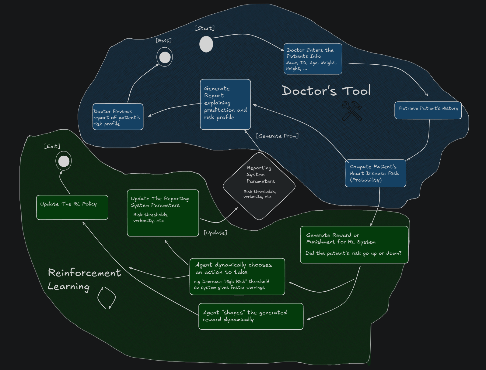

# Agent‑Augmented Q‑Learning for Healthcare Reporting

---

## 1. Overview

We are developing a **hybrid reinforcement‑learning (RL) system** that:

1. **Compares** traditional **pure Q‑learning** against
2. **Agent‑augmented Q‑learning** (using CrewAI agents to shape context, actions, and rewards),

and then demonstrates the **agentic RL** approach in a **healthcare reporting** application.

Our pipeline includes:

* **Synthetic data generation** to create realistic patient trajectories.
* **Offline RL modules** for pure Q‑learning training and evaluation.
* **CrewAI‑based RL Flow** for agentic training.
* A **reporting flow** that generates patient risk reports (prediction + SHAP explanations).
* **Integration** of RL into the reporting flow: the RL agent dynamically tunes report configuration based on patient outcomes.

---

## 2. Synthetic Data Generation

### 2.1 Anchors & Trajectories

* We extract **anchor pairs** $(p_{\text{start}}, p_{\text{end}})$ by sampling “Present” and “Absent” entries from the original Heart Disease CSV.
* Each anchor pair seeds one **base trajectory**:

  $$
    \{p_0, p_1, \dots, p_{T-1}\}\quad\text{drifting smoothly from }p_0 \to p_{T-1}.
  $$
* **Rationale**: Anchors model realistic inflection points (onset/remission) in patient risk.

### 2.2 Drift Model

We simulate each base trajectory by repeatedly applying:

```python
alpha = t/(T-1)
p_base = (1-alpha)*p_start + alpha*p_end + Normal(0, σ)
p_base = clip(p_base, 0,1)
```

* **Gaussian noise** (σ≈0.02) introduces stochasticity.
* No action noise at this stage—pure drift only.

### 2.3 Action‑Dependent Noise

At runtime, when the RL policy picks an action $a_t$, we adjust:

```python
delta = Uniform(δₘᵢₙ, δₘₐₓ)  # e.g. 0.01–0.05
if a_t.startswith("DECREASE"):
    p_{t+1} = p_{\text{base}} - delta
elif a_t.startswith("INCREASE"):
    p_{t+1} = p_{\text{base}} + delta
else:  # NOP
    p_{t+1} = p_{\text{base}}
p_{t+1} = clip(p_{t+1}, 0, 1)
```

* **Allows** the agent’s discrete actions (threshold shifts, SHAP verbosity changes) to have a **measurable effect** on patient risk.
* **NOTE**: This action dependant noise is for evaluation purposes, in a real world medical context this would obviously be excluded.

---

## 3. Reinforcement‑Learning Framework

### 3.1 Markov Decision Process

* **States** $s_t$: discretized risk $p_t\in[0,1]$ into 10 bins (0…9).
* **Actions** $a_t$ (7 total):

  * `INCREASE_MODERATE_THRESHOLD` / `DECREASE_MODERATE_THRESHOLD`
  * `INCREASE_HIGH_THRESHOLD`     / `DECREASE_HIGH_THRESHOLD`
  * `INCREASE_TOP_K`              / `DECREASE_TOP_K`
  * `NOP`
* **Rewards** $r_t$:

In our MDP, rather than using a flat ±1/0 reward, we define the reward as the **actual change in risk probability** (scaled to integer rewards). Concretely:

```math
r_t = \bigl\lfloor\, (p_t - p_{t+1}) \times M \bigr\rfloor
```

* If the patient’s predicted risk **drops** by 0.20, then
  $\displaystyle r_t = \lfloor 0.20 \times M\rfloor = +2$.
* If the risk **rises** by 0.05, then
  $\displaystyle r_t = \lfloor -0.05 \times M\rfloor = -0$  (or –1 if you choose to round away from zero).
* No change → $r_t = 0$.

Here, $M$ is a **scaling factor** matching the number of discrete bins you choose. In our original design $M=10$, but one might find it wiser to increase bin granularity—e.g. $M=20$ or $M=50$—so that small changes in probability produce meaningful nonzero rewards and the agent receives **richer feedback** at each step.


### 3.2 Pure Q‑Learning

* **Offline training** via `train_q_table`:

  ```python
  Q[s,a] ← Q[s,a] + α [ r + γ·max_{a′} Q[s′,a′] – Q[s,a] ]
  ```
* **Exploration policies**: ε‑greedy, softmax, UCB, Thompson sampling, etc.
* **Evaluation**: freeze Q‑table, run greedy policy on held‑out drift trajectories.

### 3.3 Agent‑Augmented Q‑Learning

* **RLEngine** implements:

  * `encode_prev_state`, `encode_curr_state`
  * `compute_env_reward` (pure reward)
  * `generate_context` (via a **ContextProvidingAgent**)
  * `shape_action`   (via a **PolicyAgent**)
  * `shape_reward`   (via a **RewardShapingAgent**)
  * `save_state`     (updates Q‑table)

* **RLFlow** (CrewAI Flow) orchestrates the MDP step:

  1. Encode previous state
  2. Encode current state
  3. Compute raw reward
  4. Generate context (agentic summary)
  5. Shape action (agentic policy)
  6. Shape reward (agentic reward)
  7. Update Q‑table

* **Offline evaluation**: after training on synthetic episodes, we extract the learned Q‑table and evaluate it exactly like pure Q‑learning.

---

## 4. Modules & Directory Layout
## Project Structure

```text
Health‑Coach/
├── data/           # raw and synthetic datasets
├── knowledge/      # domain documents (e.g. risk guidelines)
├── models/         # trained ML models (e.g. logistic regression)
├── out/            # experiment outputs, reports, logs
├── resources/      # ancillary files (e.g. diagrams)
├── pyproject.toml  # project metadata
├── README.md       # high‑level overview
└── src/
    └── health_coach/
        ├── agents.py        # Agent classes for context, policy, reward shaping
        ├── crew.py          # High‑level orchestration of CrewAI agents
        ├── flows.py         # Definition of the RLFlow (step‑by‑step MDP flow)
        ├── main.py          # Entry point / experiment runner
        ├── rl.py            # RLEngine and QLearningEngine implementations
        ├── rl_data_gen/     # Synthetic data & drift‑model generation
        ├── rl_train/        # Offline and online Q‑learning training scripts
        ├── compare/         # Comparison harness for pure vs. agentic RL
        ├── tasks.py         # Scheduled‑task definitions (automations)
        ├── tools/           # CrewAI @tool definitions (action, context, reward)
        └── tests/           # Unit and integration tests
```

* **Data generation** (`rl_data_gen/`),
* **Training scripts** (`rl_train/`),
* **Experiment orchestration** (`compare/`, `main.py`),
* **Agent definitions** (`agents.py`, `crew.py`),
* **Supporting tools** (`tools/`), and
* **Tests** (`tests/`).

* **`generate.py`** & **`drift.py`** implement the data‑generation logic above.
* **`offline_train.py`** provides `train_q_table` and `evaluate_policy` on lists of step‑dicts.
* **`env.py`** wraps synthetic episodes into a Gym interface for online evaluation.
* **`flows.py`** and **`rl.py`** define the CrewAI flow and the abstract RL engine.
* **`agents.py`** encodes the domain‑specific roles/backstories for each agent.
* **`compare.py`** drives batch experiments:

  * Sweeps pure-explorer strategies
  * Sweeps `(action, context, reward)` agentic combos
  * Records mean ± std cumulative returns over multiple seeds

---

## 5. Healthcare Reporting Integration

Currently the reporting pipeline operates on a simple logistic regression model sourced from github. Once the final prototype is built, it may be wise to swap in a more mature model, perhaps the one Sham's has developed, or another. The RL and reporting flow is more or less independent of any specific prediction model, only the prediction, and explanatory tool's used by the agents would need to be refactored.

### 5.1 Reporting Pipeline

1. **Input**: 13‑element patient feature vector.
2. **Prediction**: scikit‑learn logistic regression → $p_{\text{risk}}$.
3. **Explanation**: SHAP value extraction → feature‑level contributions.
4. **Report generation**: HTML template filled with risk, top‑k SHAP, narrative.

### 5.2 RL Flow Coupling

* **Config file** (`config.yml`) controls:

  * `thresholds.moderate`, `thresholds.high`
  * `explanation.top_k`
* The **RLFlow** runs **concurrently** with the reporting flow:

  * **State** = discretized $p_{\text{risk}}$ at each patient visit.
  * **Action** = config adjustment (e.g. raise “high” threshold if patients keep getting flagged).
  * **Reward** = did the patient’s predicted risk improve on next visit?
* The **report** and **RL** loops communicate via:

  * Updated YAML written by the RL agent
  * Patient history CSV appended with `(State, Action, Reward, Next_State)`

### RL + Reporting Agents

* **DataLoaderAgent** (`data_input_agent`)
  Responsible for reliably loading structured data (CSV, JSON, database) into the pipeline, validating schema and retrying on I/O errors.

* **DataExportAgent** (`data_export_agent`)
  Handles atomic, error‑tolerant persistence of structured outputs (reports, logs, Q‑tables) to disk or external stores.

* **PolicyAgent** (`policy_agent`)
  Acts as the RL policy oracle, selecting the next discrete action index based on the current encoded state.

* **ContextProvidingAgent** (`context_providing_agent`)
  Gathers and summarizes per‑step contextual information (visit counts, reward trends, Q‑table stats) into a concise JSON for downstream shaping.

* **RewardShapingAgent** (`reward_shaping_agent`)
  Inspects each transition’s raw reward and uses context tools (visitation counts, momentum, progress) to produce an augmented reward that accelerates learning.

* **PredictionAgent** (`prediction_agent`)
  Loads a trained model and, given patient features, computes the heart‑disease risk probability.

* **ExplanationAgent** (`explanation_agent`)
  Uses SHAP to generate a detailed HTML explanation of the model’s prediction, highlighting top feature contributions.

* **ReportingAgent** (`reporting_agent`)
  Fills an HTML medical‑report template with features, risk score, and explanation, then saves the report file to disk.

**NOTE**: When the reporting system and rl system are merged into an application, some of these agents may be dropped. For example the _DataLoader_, _DataExporterAgent_, and _PredictionAgent_ do nothing more than call a function, might as well just call those functions directly. 




---

## 6. Agent‑Augmented Q‑Learning: Rationale & Mechanisms

---

### 6.1 Why Augment Q‑Learning with Agents?

1. **Static vs. Dynamic Adaptation**

   * **Pure Q‑learning** uses a fixed update rule and exploration schedule throughout training. Once you pick ε, temperature, bonuses, etc., they stay the same (or evolve according to a preset decay).
   * **Agent‑augmented Q‑learning** hands those key decisions off to specialized “agent” modules at each step. This lets the system **continuously adapt** exploration, action selection, and reward shaping based on both current performance and high‑level context.

2. **Leverage Domain & Meta‑Knowledge**

   * Each agent is bootstrapped with a **knowledge source** covering Q‑learning fundamentals, exploration strategies, reward‑shaping techniques, and best practices.
   * Agents can detect “we’re stuck in a local optimum,” “we’ve under‑explored state 4,” or “recent rewards have plateaued”—and dynamically switch strategies to recover.

3. **Finer‑Grained Control**

   * Traditional RL can only adjust parameters on a global schedule (e.g. exponential ε‑decay).
   * Agents run **inline**, per‐step, allowing for context‑aware tweaks:

     * **“If visit‐count for s=3 is low, bump ε to 0.2 this step.”**
     * **“If recent trend of rewards is negative, switch to greedy exploitation for 5 steps.”**

4. **Modular & Extensible**

   * We chose **Q‑learning** for its simplicity: a clear tabular update, minimal hyperparameters, and easy policy extraction.
   * Building on this, our agent framework remains **modular**—you can plug in new exploration or reward‑shaping agents without rewriting the core algorithm.

---

### 6.2 Exploration Tools & Their Roles

| Tool                  | Purpose                                                        | When to Use                                                         |
| --------------------- | -------------------------------------------------------------- | ------------------------------------------------------------------- |
| **ε‑Greedy**          | With probability ε choose a random action; else pick argmax Q. | Basic baseline; good for steady exploration/exploitation trade‑off. |
| **Softmax**           | Sample actions ∼ Boltzmann(Q/temperature).                     | Smooth exploration; temperature controls randomness.                |
| **UCB**               | Argmax of Q + c·√(ln N(s)+1)/(N(s,a)+1).                       | Balance exploration based on visit‐counts; good for sparse visits.  |
| **Count‑Bonus**       | Argmax of Q + β / √(N(s,a)+1).                                 | Directly rewards under‑visited (s,a) pairs; accelerates coverage.   |
| **Thompson Sampling** | Sample Q’∼N(mean=Q, std=σ); pick argmax Q’.                    | Probabilistic exploration; adapts to uncertainty in estimates.      |
| **MaxEnt**            | Alias for Softmax (with α temperature parameter).              | Emphasize maximum entropy; robust against premature convergence.    |

---

### 6.3 Reward‑Shaping Tools & Their Benefits

| Tool                                      | Transformation                      | Benefit                                                       |
| ----------------------------------------- | ----------------------------------- | ------------------------------------------------------------- |
| **Visitation Count Bonus**<br>`shape_vcb` |  r ↦ r + η / √(N(s)+1)              | Encourages visiting rare states; combats state neglect.       |
| **Rare Transition Bonus**<br>`shape_rtb`  |  r ↦ r + ν / (N(s,a→s′)+1)          | Rewards novel (s,a,s′) transitions; uncovers hidden dynamics. |
| **Trend Shaper**<br>`shape_trend`         |  r ↦ r + τ·(MAₜ – MAₜ₋₁)            | Leverages reward momentum; amplifies consistent improvement.  |
| **Progress Shaper**<br>`shape_progress`   |  r ↦ r·(timestep / episode\_length) | Gradually increases learning pressure as episode advances.    |
| **Amplify**<br>`shape_amplify`            |  r ↦ r × factor                     | Simple scaling; magnifies or tempers reward signal at will.   |

---

### 6.4 Context‑Providing Tools

Agents shaping context can query the current episode via:

* **Episode Length** (`get_episode_length`)
* **Moving Average of Rewards** (`get_moving_average`)
* **Visit/Transition Counts** (`get_visit_count`, `get_transition_count`)
* **Raw Q‑Table** (`get_q_table`)

By ingesting this context, a **ContextAgent** can summarize, “State 5 has only been visited twice this episode” or “Mean reward over last 5 steps is –0.2,” and feed that into later shaping decisions.

---

### 6.5 Continuous Augmentation in Action

Imagine an RL run where:

1. **Early Training**: the ContextAgent detects **high Q‑uncertainty** (via synthetic posterior stdevs). The PolicyAgent chooses **Thompson Sampling** to aggressively explore promising arms.
2. **Mid‑Training**: after 100 episodes, the TrendingAgent observes **diminishing reward improvements**. It switches to **ε‑greedy** with ε=0.01 for stable exploitation.
3. **Late Training**: VisitCountBonus is turned on to ensure corner‐case states (e.g. s=9) are still sampled at least once before termination.

None of this would be possible with static schedules, agents inject **semantic**, **per‑step** adjustments based on both global and local context.

---

### 6.6 Why Q‑Learning?

* **Simplicity**: one tabular update rule, easy to inspect and debug.
* **Transparency**: Q‑values clearly map state to action values, ideal for healthcare explainability.
* **Extensibility**: we layer our agentic tools on top without changing the core algorithm, ensuring the baseline remains solid and interpretable.

By combining Q‑learning’s clarity with agentic augmentation, we create an RL system that is both **robust** and **adaptable**, ready for real‑world healthcare reporting.

---

## 7. Evaluation & Next Steps

The work that needs to be completed:

1. **Run batch comparison** (`main_compare.py`):

   * Pure Q‑learning vs. Agent‑augmented Q‑learning
   * Multiple random seeds, train/val split on synthetic episodes
   * Metrics: mean cumulative reward, policy stability, action distributions
2. **Merge flows**: combine reporting and RL into one CrewAI process with a simple UI and persistent storage (csv, small db, crewai's @persist decorator).
3. **Demo**: interactive dashboard showcasing “agentic RL in healthcare”—clinician enters features, sees risk report, config adjusts over time to optimize patient outcomes.

---

## 8. Rationale & Expected Impact

* **Synthetic trajectories** grounded in real anchor pairs ensure RL trains on plausible clinical progressions.
* **Agentic augmentation** taps domain knowledge (via context & reward‑shaping agents) to accelerate learning and improve policy quality.
* **Modular design** (tool–task–agent–flow) makes the system extensible to other healthcare settings (e.g. diabetes management, readmission risk).
* **Clinical demo** will illustrate how an “intelligent” report system can adapt thresholds and explanations over time to better guide clinician decisions.
